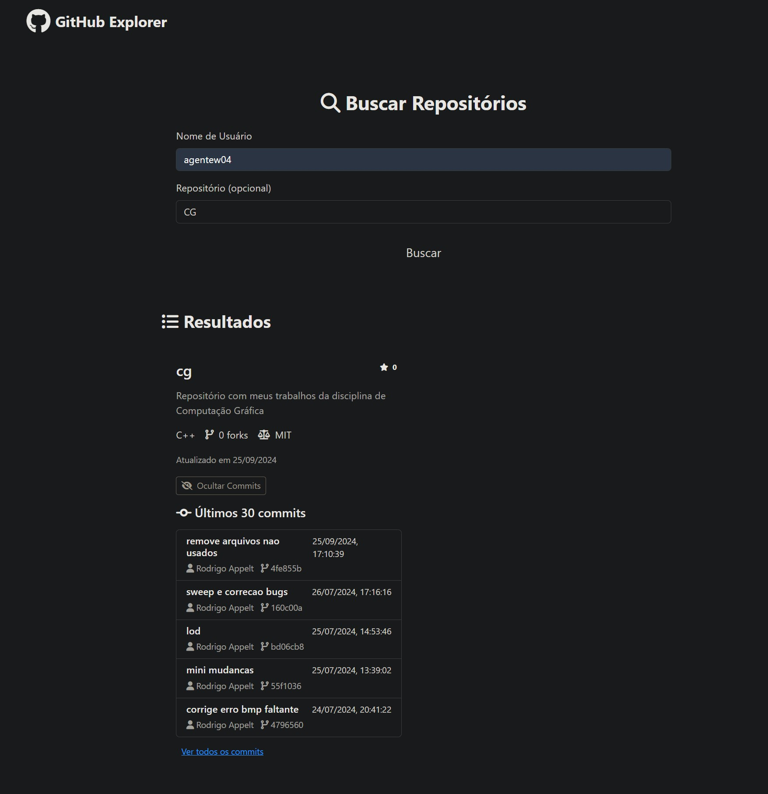

 #### Deploy
 
 https://elc1090.github.io/project2a-2025a-lorenzotaschetto/ 
 
 #### Desenvolvedor 
 Lorenzo Sacchet Taschetto
 
 #### Ambiente de desenvolvimento
 
 - VS Code (Live Server e Copilot)
 
 #### Créditos
 
 https://codesnippet.io/github-api-tutorial/
 
 #### Bastidores
  
 Um dos principais desafios foi entender e utilizar a API pública do GitHub, como usar as rotas corretas e tratar os diferentes cenários (usuário inexistente, repositório não encontrado). A partir disso, foram adquiridos conhecimentos em consumo de APIs com fetch, 
 tratamento de erros, e manipulação do DOM em conjunto ao desenvolvimento de uma interface agradável, moderna e funcional usando CSS customizado com variáveis e transições.
  
 ---
 Projeto entregue para a disciplina de [Desenvolvimento de Software para a Web](http://github.com/andreainfufsm/elc1090-2025a) em 2025a
